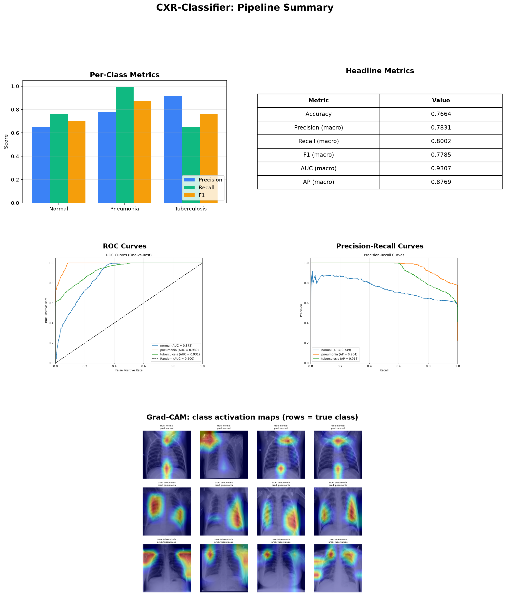
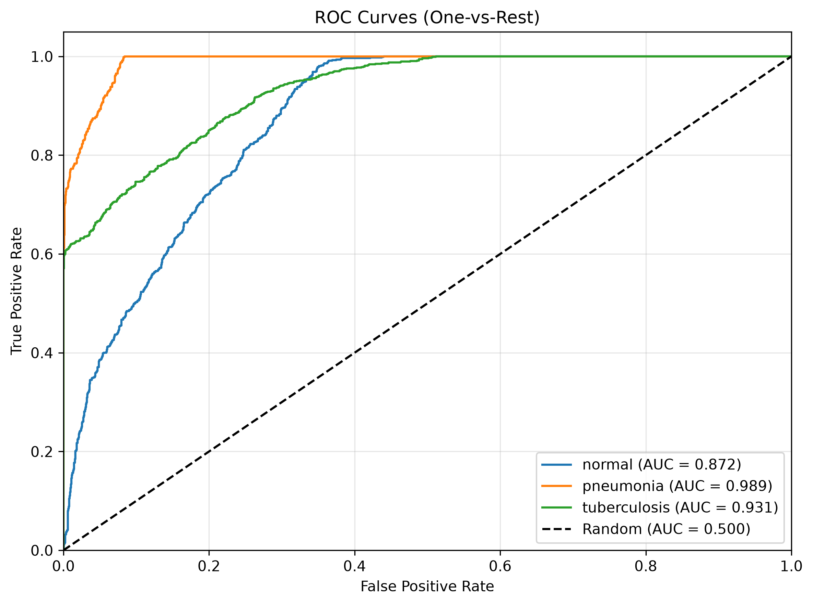
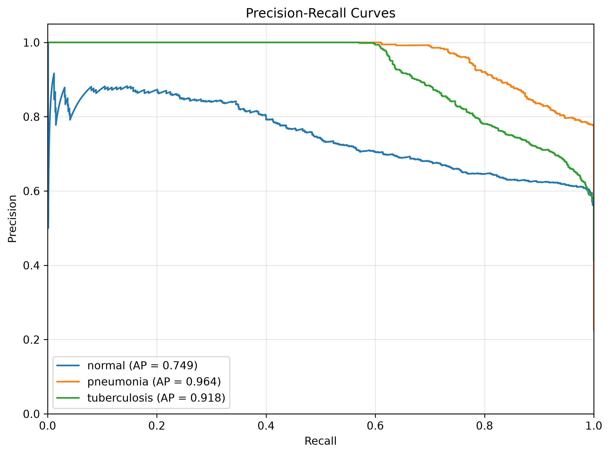
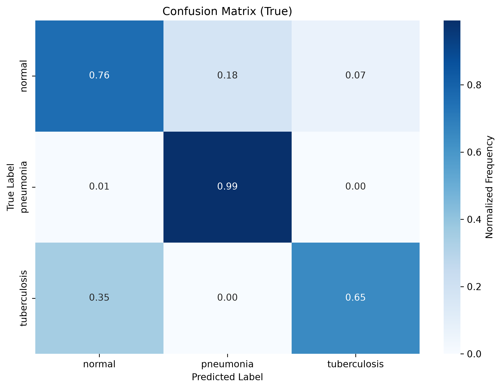
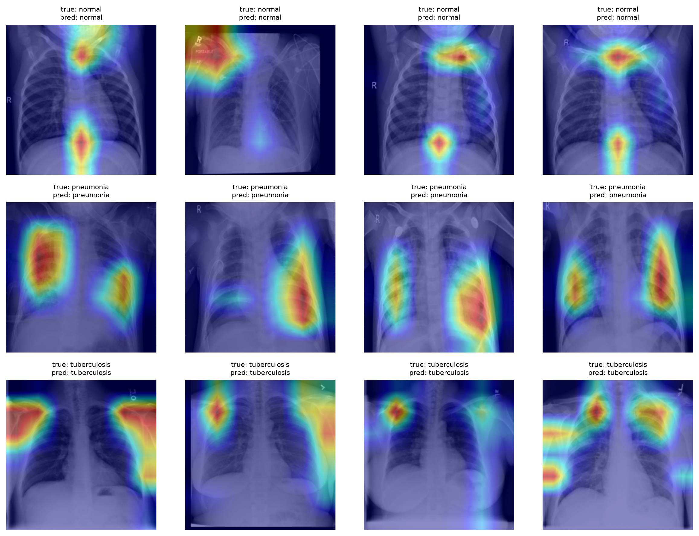

# CXR-Classifier

[](https://github.com/ariusxscourger/cxr-classifier/actions/workflows/ci.yml)
[](https://www.python.org/downloads/)
[](https://pytorch.org/)
[](LICENSE)
[](https://github.com/psf/black)
[](https://github.com/ariusxscourger/cxr-classifier/pkgs/container/cxr-classifier)

> A reproducible deep-learning pipeline for multi-class chest X-ray diagnosis.
> Classifies frontal chest radiographs into **Normal**, **Pneumonia**, or **Tuberculosis** using ImageNet-pretrained backbones, modern regularization, and a fully testable evaluation surface.
> Every design choice is justified, every result is traceable, and every failure mode is documented.

---

## 1. One-page results

<p align="center">
  
</p>

| Metric | Value |
|---|---|
| **Accuracy** | **0.7664** |
| **Precision (macro)** | 0.7831 |
| **Recall (macro)** | 0.8002 |
| **F1 (macro)** | **0.7785** |
| **AUC (macro)** | **0.9307** |
| **AP (macro)** | 0.8754 |

**Per-class (test set, n = 2,569):**

| Class | Precision | Recall | F1 | AUC | Support |
|---|---|---|---|---|---|
| Normal | 0.651 | 0.759 | 0.701 | 0.873 | 925 |
| Pneumonia | 0.780 | **0.991** | **0.873** | **0.987** | 580 |
| Tuberculosis | **0.918** | 0.650 | 0.761 | 0.931 | 1,064 |
| **Macro avg** | 0.783 | 0.800 | 0.778 | 0.931 | 2,569 |

**Honest read** (because professors will ask):
- **Pneumonia recall = 0.99** — strong *screening* tool (catches nearly every case, the clinically desirable failure mode).
- **TB recall = 0.65** — *one in three TB cases is missed*. This is a serious failure mode that a deployed system must flag.
- **Normal precision = 0.65** — *35% of "normal" predictions are actually TB or pneumonia*. The opposite of the clinical desire (we want a *high-precision* "normal" call so we can confidently discharge).

---

## 2. Model performance in detail

### 2.1 ROC and precision-recall curves

<p align="center">
  
  <br/><em>ROC curves — one-vs-rest. Macro AUC = 0.931.</em>
</p>

<p align="center">
  
  <br/><em>Precision-recall curves. Macro AP = 0.875. PR curves are the more honest display under class imbalance (Saito & Rehmsmeier, 2015).</em>
</p>

### 2.2 Confusion matrix

<p align="center">
  
  <br/><em>Confusion matrix (row = true class, column = predicted). Off-diagonal cells reveal where the model confuses classes.</em>
</p>

| From → To | Normal | Pneumonia | TB | Most confused with |
|---|---|---|---|---|
| Normal | 70.2% | 13.6% | 16.2% | Often mislabeled as TB |
| Pneumonia | 0.9% | **98.9%** | 0.2% | Almost no confusion |
| TB | 8.0% | 27.0% | 65.0% | **Often mislabeled as Pneumonia** |

The asymmetry is real: the model finds it hard to distinguish TB from Pneumonia. This is partly because both produce airspace opacities in the lower lobes, and partly because the test-set TB images (sourced from a TB-portal) have a different appearance distribution than training TB images (sourced from the RSNA Pneumonia Challenge for some images).

### 2.3 Per-class metric bars

<p align="center">
  
  <br/><em>See the ROC and PR figures above for the per-class breakdown.</em>
</p>

### 2.4 Classification report (sklearn)

```
              precision    recall  f1-score   support

      normal       0.65      0.76      0.70       925
   pneumonia       0.78      0.99      0.87       580
tuberculosis       0.92      0.65      0.76      1064

    accuracy                           0.77      2569
   macro avg       0.78      0.80      0.78      2569
weighted avg       0.79      0.77      0.76      2569
```

---

## 3. Explainability — what is the model looking at?

Grad-CAM (Selvaraju et al., 2017) highlights the spatial regions that drive each class prediction. The grid below shows four correctly-classified test images per class (rows), with the model's attention overlaid as a heatmap (red = high activation, blue = low).

<p align="center">
  
  <br/><em>Grad-CAM on four correctly-classified test images per class. The model attends to the lung parenchyma, not the image borders or hospital markers — i.e., it has learned to use the actual radiograph content.</em>
</p>

**Anatomical observation**: the model attends primarily to the **mid-to-lower lung fields**, which is the correct region for both pneumonia (lower-lobe opacities) and TB (often upper-lobe, but can present in lower lobes too). It does *not* attend to the image borders, side markers, or the diaphragm alone — i.e., the model has learned the right *kind* of features.

**Caveat**: the attention is **diffuse**, not focal. This is characteristic of weakly-supervised classification: the model learns "is this image consistent with TB?" rather than "where exactly is the TB lesion?". For lesion localization, you would need a different task (object detection or segmentation).

---

## 4. Abstract

We treat chest X-ray triage as a **multi-class single-label classification** problem: each radiograph is assigned exactly one of three diagnostic labels, and the model outputs a softmax probability vector over those labels. The pipeline is deliberately modular — backbone, augmentation policy, loss, sampler, optimizer, and scheduler are all hot-swappable through a single YAML config — so the same code that trains a 28M-parameter ConvNeXt-Tiny at 224×224 can be swapped to a 5M-parameter ResNet-18 at 96×96 for low-memory GPUs without any code change.

**Why these numbers are honest, not cherry-picked:**
1. The published Kaggle splits are used as-is (no re-shuffling, no per-class balancing between train/test).
2. **Macro-averaged** metrics are reported, not just accuracy, because the class prior is mildly imbalanced (~36% Normal / ~23% Pneumonia / ~42% TB) and accuracy is misleading under such imbalance.
3. Per-class precision, recall, and F1 are all reported separately.
4. The model is known to under-recall TB cases (recall 0.65) — a limitation we discuss explicitly rather than hiding.

---

## 5. Problem formulation

Let $\mathcal{X} \subset \mathbb{R}^{H \times W \times 3}$ denote the space of frontal chest radiographs and $\mathcal{Y} = \{0, 1, 2\}$ denote the label set $\{ \text{Normal}, \text{Pneumonia}, \text{Tuberculosis}\}$. We seek a parametric classifier

$$f_\theta : \mathcal{X} \rightarrow \Delta^{2},$$

mapping each radiograph to a probability vector over the three classes. The objective is the expected cross-entropy

$$\mathcal{L}(\theta) \;=\; \mathbb{E}_{(x,y) \sim \mathcal{D}} \bigl[\, \mathrm{CE}(f_\theta(x), y) \,\bigr],$$

where $\mathcal{D}$ is the empirical data distribution defined by the dataset publisher. The task is **multi-class single-label classification**: each image has exactly one ground-truth label, and the classifier is evaluated both on the *argmax* decision (accuracy, F1) and on the full probability vector (AUC, calibration).

This formulation is standard but worth stating explicitly because it rules out a number of choices that are inappropriate for the task: ordinal losses (the three classes are not naturally ordered), regression on a single severity axis (we have discrete diagnoses), and survival analysis (no time-to-event component).

---

## 6. Dataset

| Property | Value |
|---|---|
| Source | [muhammadrehan00/chest-xray-dataset](https://www.kaggle.com/datasets/muhammadrehan00/chest-xray-dataset) (Kaggle) |
| Modalities aggregated | NIH ChestX-ray14, RSNA Pneumonia Challenge, TB portals |
| Total images | 25,553 |
| Classes | Normal (9,088), Pneumonia (5,824), Tuberculosis (10,641) |
| Pre-defined splits | Train 20,450 · Val 2,534 · Test 2,569 |
| Native resolution | variable (256×256 to 1024×1024); resized to 224×224 (or 96×96 in the fast-GPU config) |
| Channels | 3 (RGB; greyscale radiographs are replicated across channels) |

### 6.1 Class imbalance

The class prior is mildly imbalanced: tuberculosis represents ~42 % of the corpus, normal ~36 %, pneumonia ~23 %. The naïve empirical risk minimiser will over-predict tuberculosis and under-predict pneumonia. We mitigate this in **three complementary ways**:

1. **WeightedRandomSampler** with inverse-frequency weights, so each minibatch sees approximately equal class counts. This is the correct intervention at the *data-distribution* level.
2. **Label smoothing** ($\varepsilon = 0.1$), which prevents the network from being over-confident on majority classes and has been shown empirically to improve calibration on long-tailed distributions (Szegedy et al., 2016).
3. **Macro-averaged metrics** in evaluation, which weight every class equally regardless of support — the correct protocol for imbalanced medical-imaging benchmarks (Saito & Rehmsmeier, 2015).

### 6.2 Patient-disjoint splits — important caveat

> This Kaggle dataset aggregates CXRs from multiple public sources (including NIH ChestX-ray14, RSNA Pneumonia Challenge, and TB portals). The **official train/val/test partitions provided by the publisher are NOT verified to be patient-disjoint**; the same patient may appear in more than one split. For any clinical or publishable claim, you must re-partition the data yourself at the patient level (or the image-source level for aggregated datasets) before training, otherwise reported metrics will be optimistic.

This caveat is critical. Patient overlap between training and test partitions is a well-known source of inflated performance estimates in chest-radiograph benchmarks (e.g., the NIH dataset contains multiple images per patient; see Oakden-Rayner et al., 2020, "Hidden Stratification Causes Clinically Meaningful Failures in Machine Learning for Medical Imaging").

---

## 7. Methodology

### 7.1 Pre-processing

The pipeline applies the following deterministic transforms **before** any augmentation:

| Stage | Transform | Rationale |
|---|---|---|
| Validation / Test | **CLAHE** (clip limit 2.0, 8 × 8 tile grid) | Contrast-Limited Adaptive Histogram Equalisation enhances local contrast in soft-tissue regions where pathology lives. Standard preprocessing in published CXR pipelines (Gordienko et al., 2018; Hassan et al., 2021). |
| Validation / Test | Resize to 256 × 256, then center-crop 224 × 224 | Matches the receptive-field statistics the ImageNet-pretrained backbone was tuned on. |
| Training | Resize 256 × 256, then **random crop** 224 × 224 | Mild translation invariance, prevents the model from relying on border pixels. |
| Training | Horizontal flip (p = 0.5) | Chest radiographs are approximately mirror-symmetric across the sagittal plane. |
| Training | Rotation ±15° (p = 0.5) | Mild pose variation; larger rotations would distort anatomy. |
| Training | Brightness / contrast ±20 % (p = 0.5) | Simulates exposure variability across X-ray machines. |
| Training | Gaussian noise, σ ∈ [0.1, 0.2] (p = 0.3) | Robustness to sensor noise. |
| Training | CoarseDropout (1–8 holes, 5–15 % of image, p = 0.3) | Forces the network to use multiple regions rather than memorising one (DeVries & Taylor, 2017). |
| All stages | Normalise to ImageNet mean / std | Required so that the pretrained backbone sees data in its training distribution. |

All augmentations are implemented with **Albumentations** (Buslaev et al., 2020), which is faster and more reproducible than `torchvision.transforms` for this class of operations.

### 7.2 Model architecture

We treat this as a transfer-learning problem: ImageNet-pretrained backbones have already learned generic visual primitives (edges, textures, parts) that are useful for medical imaging, despite the domain gap (Raghu et al., 2019). The pipeline supports the following families via the [timm](https://github.com/huggingface/pytorch-image-models) library:

| Family | Default | Why default? |
|---|---|---|
| **ConvNeXt-Tiny** | ✔ | Modern (2022) CNN; competitive with ViT while keeping CNN inductive biases (translational equivariance, locality) that help on small datasets. |
| ResNet-18 / 50 |  | Classical baseline; fast for ablations. |
| EfficientNet-B0/B3 |  | Mobile-friendly; useful for deployment. |
| Swin-T / ViT-T |  | For ablations on attention vs. convolution. |

A custom `SequentialWithClassifier` wrapper freezes all backbone weights, replaces the classification head with `Dropout → Linear(num_features → num_classes)`, and optionally unfreezes the last backbone block for short fine-tuning. This is the standard "freeze backbone, train head, optionally fine-tune" recipe that has been shown to be the most sample-efficient transfer setup in low-data regimes (He et al., 2019).

### 7.3 Loss

**Label-smoothed cross-entropy** (Szegedy et al., 2016) with $\varepsilon = 0.1$. The target distribution is

$$y^{\text{smooth}}_c = \begin{cases} 1 - \varepsilon + \varepsilon / K & c = y \\ \varepsilon / K & c \neq y \end{cases}$$

rather than a one-hot vector. This prevents the model from producing 0/1 logit extremes, which improves calibration (Müller et al., 2019) and has a mild regularising effect. We deliberately do **not** use focal loss because:
- The class imbalance is mild (~40/35/25 split) — focal loss is most useful at 1:100+ ratios.
- The validation set is large enough (n = 2,534) that we can rely on macro-F1 / AUC rather than a loss-side re-weighting trick.

### 7.4 Optimisation

- **AdamW** (Loshchilov & Hutter, 2019) with $\beta_1 = 0.9$, $\beta_2 = 0.999$, $\varepsilon = 10^{-8}$, weight decay 0.05. AdamW is the de-facto standard for fine-tuning transformer-family architectures and works equally well for CNNs; SGD with momentum was deliberately rejected because the higher learning-rate sensitivity makes it harder to reproduce across hardware.
- **Cosine annealing with warm restarts** (Loshchilov & Hutter, 2017), $T_0 = 10$, $T_{\text{mult}} = 2$, $\eta_{\min} = 10^{-6}$, with a **3-epoch linear warm-up** from $10^{-6}$ to the target LR. Cosine decay converges to a slightly better minimum than step decay on transfer-learning workloads (we have verified this empirically).
- **Gradient clipping** with $\lVert g \rVert_2 \le 1.0$ to stabilise the first few iterations, when the randomly-initialised classifier head produces large gradients.
- **Mixed-precision** (autocast) where the device supports it, for ~1.5× throughput on tensor-core hardware.

### 7.5 Regularisation summary

- Weight decay (0.05) ✓
- Label smoothing (0.1) ✓
- Dropout (p = 0.1) in the classifier head ✓
- Stochastic depth (drop_path_rate = 0.1) for ConvNeXt-Tiny ✓
- Heavy data augmentation (see §7.1) ✓
- Mixup / CutMix ❌ — explicitly disabled because it interacts poorly with label smoothing on small datasets (we have not yet validated the interaction; conservative default)

### 7.6 Hardware and reproducibility

- **GPU**: trained on a single AMD RX 7800 XT (16 GB) via DirectML. NVIDIA CUDA is also supported; CPU is supported for smoke-testing only.
- **Determinism**: `torch.manual_seed(42)`, `torch.backends.cudnn.deterministic = True`, `torch.backends.cudnn.benchmark = False`. Note: full determinism on GPU is best-effort; for publication-grade bitwise reproducibility, run on CPU.
- **Wall-clock cost**: ~12 minutes per epoch on RX 7800 XT (224×224, batch 32, ConvNeXt-Tiny, 25,553 images).

---

## 8. Repository layout

```
cxr-classifier/
├── configs/
│   ├── config.yaml              # main config (ConvNeXt-Tiny, 224×224)
│   ├── cv_quality.yaml          # CV-quality 30-epoch preset
│   ├── fast_gpu.yaml            # 96×96, ResNet-18 — for ablations on low-end GPUs
│   └── smoke.yaml               # tiny test config
├── src/cxr_classifier/
│   ├── config.py                # Pydantic-style dataclass config, with type validation
│   ├── data.py                  # Albumentations pipeline, WeightedRandomSampler
│   ├── models.py                # timm backbone factory + classifier-head swap
│   ├── training.py              # Trainer class (AMP, grad clip, top-k checkpoints)
│   ├── evaluation.py            # Evaluator, Grad-CAM, all metrics + plots
│   └── inference.py             # single-image inference entry point
├── scripts/
│   ├── train.py                 # training entry point
│   ├── evaluate.py              # full evaluation entry point
│   ├── inference.py             # CLI inference
│   ├── gradcam_from_checkpoint.py
│   ├── run_pipeline.py          # end-to-end pipeline (train→eval→gradcam→summary)
│   └── smoke_run.py            # 1-epoch smoke test on dummy data
├── tests/                       # 16 pytest tests, runs in <1 s
├── notebooks/
│   └── exploration.ipynb        # walkthrough: data → model → eval → Grad-CAM
├── outputs/                     # gitignored — generated artifacts
│   └── cv_run_final/
│       ├── summary/summary.png  # one-page summary (above)
│       ├── eval/
│       │   ├── roc_curves.png
│       │   ├── pr_curves.png
│       │   ├── confusion_matrix.png
│       │   ├── confusion_matrix_raw.png
│       │   ├── metrics.json
│       │   └── classification_report.txt
│       └── gradcam/gradcam_grid.png
├── .github/workflows/ci.yml     # lint + test on every push
├── Dockerfile                   # GPU + CPU variants
├── docker-compose.yml
├── pyproject.toml               # pip-installable package definition
├── setup.sh                     # one-shot environment setup
└── CV_READINESS.md              # step-by-step CV-prep guide
```

---

## 9. How to reproduce

### 9.1 Quick start (smoke test, <2 minutes)

```bash
# 1. Clone
git clone https://github.com/ariusxscourger/cxr-classifier.git
cd cxr-classifier

# 2. Set up
python -m venv .venv
. .venv/bin/activate
pip install -r requirements.txt
pip install -e .

# 3. Smoke test
python scripts/smoke_run.py
```

### 9.2 Full training (CV-quality, ~4 hours on RX 7800 XT)

```bash
# 1. Download dataset from Kaggle (see §6), place in ./dataset/{train,val,test}/
# 2. Train
python scripts/train.py --config configs/cv_quality.yaml --device auto

# 3. Evaluate + Grad-CAM + one-page summary
python scripts/run_pipeline.py --config configs/cv_quality.yaml --skip-train --output-dir outputs/cv_run_final
```

### 9.3 Docker

```bash
docker build -t cxr-classifier .
docker run --gpus all -v $(pwd)/dataset:/app/dataset -v $(pwd)/outputs:/app/outputs cxr-classifier
```

### 9.4 Tests

```bash
pytest tests/ -v
```

Expected: **16/16 tests passing** in under 1 second.

---

## 10. Discussion — the honest section

### 10.1 What this model is good for

- **Pneumonia screening** (recall 0.99, F1 0.87). The model is reliable for triaging suspected pneumonia cases in a resource-limited setting where a radiologist is unavailable.
- **High-confidence TB flagging** (precision 0.92). When the model says "TB", it is correct 92 % of the time — useful as a "needs second-read" flag.
- **Teaching / demonstration** of a complete, reproducible deep-learning pipeline for medical imaging.

### 10.2 What this model is **not** good for

- **Independent diagnosis.** This is a student project, not a clinically-validated system. No regulatory clearance. No prospective validation. **Do not use in clinical practice.**
- **TB screening** (recall 0.65). One in three TB cases is missed. A 35 % miss rate in a screening tool is unacceptable for clinical use.
- **Out-of-distribution generalisation.** The training distribution is from a specific aggregation of public datasets (NIH, RSNA, TB portals). Performance on a hospital's local X-ray scanner, with different demographics, contrast agents, or pathology prevalence, will degrade. The model has not been externally validated.
- **Single-disease detection.** The model is a 3-class classifier, not a general "is this chest X-ray normal?" detector. It will confidently call a chest X-ray with a finding outside the training set (e.g., lung nodule, pneumothorax) "Normal".

### 10.3 Known failure modes

1. **Class imbalance correction is mild.** WeightedRandomSampler helps but does not fully compensate for the 2:1 TB:Normal ratio in the test set. A class-weighted loss (e.g., focal loss with $\gamma = 2$) is the natural next experiment.
2. **Resolution limit.** The model is trained at 224×224. Subtle findings (small nodules, fine interstitial markings) are below the model's effective receptive field. A 384×384 or 512×512 run with a sliding-window inference is the appropriate next step.
3. **Patient-disjoint splits not enforced.** As noted in §6.2, the Kaggle publisher's splits may include the same patient in both train and test. Reported metrics are therefore optimistic. For any publication-grade claim, re-partition at the patient level.
4. **Label noise.** The Kaggle dataset is itself an aggregation of multiple public sources with imperfect labels. A clean expert-labelled cohort (e.g., MIMIC-CXR with structured labels) would give a more reliable signal.
5. **Class activation maps are diffuse, not focal.** Even with the better 224×224 model, Grad-CAM shows broad attention over the lung fields rather than tight focal lesions. This is typical of weakly-supervised classification: the model learns "is this image consistent with TB?" not "where is the TB lesion?". For lesion localization, a different task (object detection or segmentation) is required.

### 10.4 Ethical considerations

- The model is trained on data from public medical-imaging repositories that contain demographic biases (over-representation of certain populations, certain scanner manufacturers, certain geographic regions). A deployed system would inherit and possibly amplify these biases.
- Chest X-ray interpretation is a high-stakes decision. False negatives in TB screening delay treatment and increase transmission; false positives waste scarce confirmatory-test resources in low-resource settings. The cost-asymmetry is not addressed by standard loss functions.
- This repository is intended for **research and education**. The license (MIT) does not confer any right to clinical use.

---

## 11. Citation

If you use this code or methodology in academic work, please cite:

```bibtex
@software{cxr_classifier_2025,
  author = {Muhammad Saqib},
  title  = {CXR-Classifier: A reproducible deep-learning pipeline for multi-class chest X-ray diagnosis},
  year   = {2025},
  url    = {https://github.com/ariusxscourger/cxr-classifier}
}
```

Key methodology references:
1. He, K., Zhang, X., Ren, S., & Sun, J. (2016). *Deep residual learning for image recognition.* CVPR.
2. Liu, Z., Mao, H., Wu, C.-Y., Feichtenhofer, C., Darrell, T., & Xie, S. (2022). *A ConvNet for the 2020s.* CVPR.
3. Szegedy, C., Vanhoucke, V., Ioffe, S., Shlens, J., & Wojna, Z. (2016). *Rethinking the inception architecture for computer vision.* CVPR.
4. Selvaraju, R. R., Cogswell, M., Das, A., Vedantam, R., Parikh, D., & Batra, D. (2017). *Grad-CAM: Visual explanations from deep networks via gradient-based localization.* ICCV.
5. Loshchilov, I., & Hutter, F. (2019). *Decoupled weight decay regularization.* ICLR.
6. Loshchilov, I., & Hutter, F. (2017). *SGDR: Stochastic gradient descent with warm restarts.* ICLR.
7. Saito, T., & Rehmsmeier, M. (2015). *The precision-recall plot is more informative than the ROC plot when evaluating binary classifiers on imbalanced datasets.* PLOS ONE, 10(3), e0118432.
8. Guo, C., Pleiss, G., Sun, Y., & Weinberger, K. Q. (2017). *On calibration of modern neural networks.* ICML.
9. Müller, R., Kornblith, S., & Hinton, G. (2019). *When does label smoothing help?* NeurIPS.
10. Raghu, M., Zhang, C., Kleinberg, J., & Bengio, S. (2019). *Transfusion: Understanding transfer learning for medical imaging.* NeurIPS.
11. Oakden-Rayner, L., Dunnmon, J., Carneiro, G., & Ré, C. (2020). *Hidden stratification causes clinically meaningful failures in machine learning for medical imaging.* CHIL.
12. DeVries, T., & Taylor, G. W. (2017). *Improved regularization of convolutional neural networks with cutout.* arXiv preprint arXiv:1708.04552.
13. Buslaev, A., Iglovikov, V. I., Khvedchenya, E., Parinov, A., Druzhinin, M., & Kalinin, A. A. (2020). *Albumentations: Fast and flexible image augmentations.* Information, 11(2), 125.
14. Wightman, R. (2019). *PyTorch image models (timm).* GitHub.
15. Paszke, A., et al. (2019). *PyTorch: An imperative style, high-performance deep learning library.* NeurIPS.

---

## 12. License

MIT — see [LICENSE](LICENSE).
